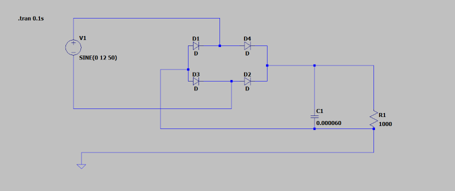
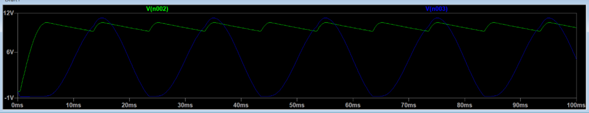

# LTspice_FullWaveBridgeRectifier
Full-wave bridge rectifier simulation and ripple voltage calculation
# Full-Wave Bridge Rectifier with Capacitor Filter (LTspice)

A simulation of a **Full-Wave Bridge Rectifier** with a **capacitor filter** designed in **LTspice**. This project demonstrates AC-to-DC conversion, output voltage smoothing, and ripple voltage analysis through both simulation and theoretical calculations.

## Features

- Full-wave bridge rectifier using four silicon diodes
- Capacitor filter for ripple reduction
- LTspice transient simulation
- Mathematical verification of ripple voltage

## Circuit Parameters

| Parameter | Value |
|----------|-------|
| Input Voltage | 12 V Peak |
| Frequency | 50 Hz |
| Load Resistance | 1 kΩ |
| Filter Capacitor | 60 μF |
| Simulation | `.tran 0.1` |

## Circuit Schematic



## Theoretical Analysis

Considering two silicon diode drops:


V_{out(peak)} = 12 - 2(0.7) = 10.6


Ripple voltage:


V_r=V_out(peak) / 2fRC
={10.6} / {2\times50\times1000\times60\times10^{-6}}
=approx 1.77 Volts


## Simulation Result



The simulation confirms the expected operation:
- Peak output voltage ≈ **10.6 V**
- Ripple voltage ≈ **1.77 V**
- Ripple frequency = **100 Hz**

## Project Structure

```text
.
├── bridge_rectifier.asc
├── images/
│   ├── schematic.png
│   └── waveform.png
└── README.md
```

## How to Run

1. Open `bridge_rectifier.asc` in LTspice.
2. Run the transient simulation (`.tran 0.1`).
3. Observe the input and filtered output waveforms.

## Tools Used

- LTspice
- Basic Analog Electronics
- Markdown

--------

⭐ If you found this project useful, consider starring the repository.
